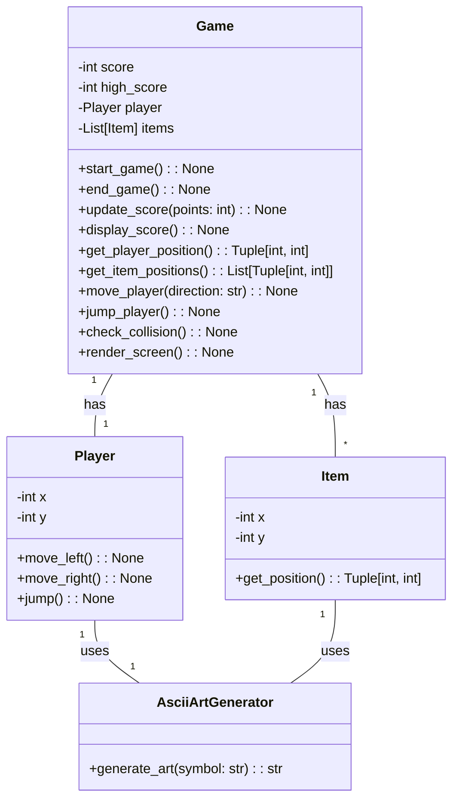
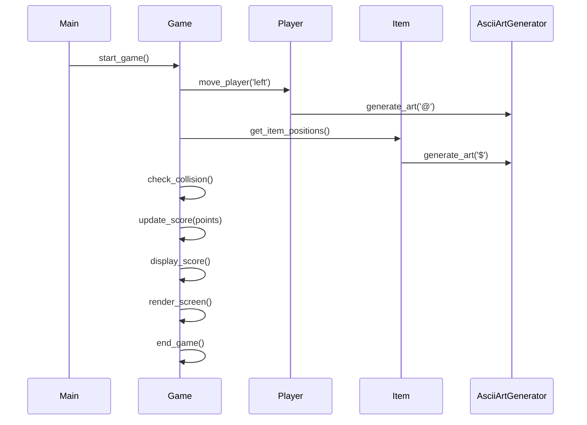

## Implementation approach:
For the implementation of the text-based game, we will use the following open-source tools:

1. Python: We will use Python as the programming language for developing the game. Python is a widely used and versatile language that provides a rich set of libraries and frameworks for game development.

2. Pygame: Pygame is a popular open-source library for game development in Python. It provides a set of functions and classes for creating games and handling user input, graphics, and sound. We will use Pygame to handle the game logic, player movement, item collection, and rendering of the game screen.

3. ASCII Art Generator: To create ASCII art for the game characters and items, we will use an open-source ASCII art generator library. This will allow us to generate visually appealing and unique ASCII art representations for the game elements.

4. Random module: We will use the random module in Python to generate random positions for the items in the game. This will ensure that the items are placed at different locations each time the game is played, adding variability and challenge to the gameplay.

## Python package name:
```python
"text_game"
```

## File list:
```python
[
    "main.py",
    "game.py",
    "player.py",
    "item.py",
    "ascii_art_generator.py"
]
```

## Data structures and interface definitions:


## Program call flow:


## Anything UNCLEAR:
The requirements are clear and there are no unclear points.